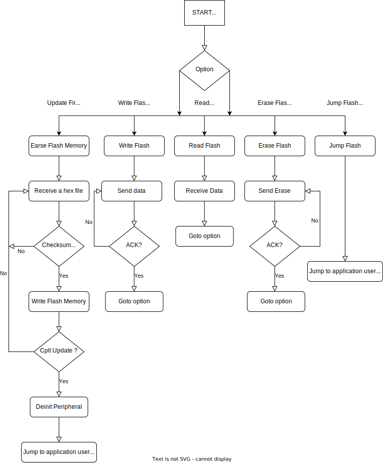
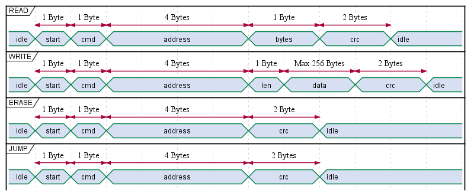

# Project Bootloader STM32F4

## Purpose

The purpose of Bootloader STM32F4 Project is update firmware for microcontroller STM32 via UART.

## Features

Bootloader STM32 includes the following features:

1. **Read Flash Memory**
2. **Write Flash Memory**
3. **Erase Flash Memory**
4. **Jump Flash Memory**
5. **Update Firmware**

## Detailed Bootloader

1. **Address Save Bootloader**: 0x08000000 (32KBytes)
2. **Address Load Firmware**: 0x08008000
3. **Speed UART use**: 115200
4. **Note**: bootloader not protect memory

## Flowchart Bootloder STM322F4

## Architecture Frame Data

## Developer
**Le Van Quy**
